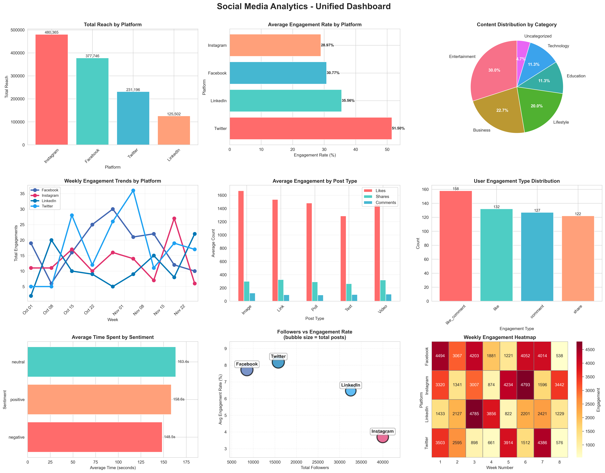

# Social Media Analytics - Multi-Source Data Integration

A comprehensive data integration project that combines data from multiple sources (CSV, JSON, XML) to create unified visualizations analyzing social media engagement across platforms.



## 📋 Project Overview

This project demonstrates end-to-end data integration from multiple heterogeneous sources to create actionable insights about social media performance. The system processes structured and semi-structured data, performs comprehensive cleaning and transformation, and produces an integrated analytics dashboard.

### Key Features

- **Multi-format data parsing**: CSV, JSON, and XML
- **Robust data cleaning**: Handles missing values, standardizes formats
- **Strategic data integration**: Multiple join strategies with validation
- **Comprehensive visualizations**: 9-chart unified dashboard
- **Streaming data concepts**: Real-time data processing demonstration

## 🎯 Business Problem

Social media teams need to analyze engagement patterns across multiple platforms (Facebook, Instagram, Twitter, LinkedIn) but data exists in different formats across various systems. This project creates a unified view enabling:

- Cross-platform performance comparison
- Content optimization insights
- User engagement pattern analysis
- Temporal trend identification

## 📊 Data Sources

### 1. Social Media Posts (CSV)
- **Records**: 150 posts across 4 platforms
- **Time Period**: 58 days (Oct-Nov 2024)
- **Metrics**: likes, shares, comments, reach
- **Format**: Structured tabular data

### 2. User Engagement (JSON)
- **Records**: 539 engagement actions from 100 users
- **Data**: Engagement type, timestamp, time spent, sentiment
- **Format**: Semi-structured nested JSON

### 3. Platform Metrics (XML)
- **Records**: 4 platforms + 32 weekly records
- **Data**: Demographics, performance KPIs, trends
- **Format**: Hierarchical XML structure

## 🛠️ Technology Stack

- **Python 3.x**: Core programming language
- **Pandas**: Data manipulation and analysis
- **Matplotlib & Seaborn**: Data visualization
- **Jupyter Notebook**: Interactive development
- **XML/JSON libraries**: Data parsing

## 🚀 Getting Started

### Prerequisites

```bash
Python 3.8 or higher
pip (Python package manager)
```

### Installation

1. Clone the repository
```bash
git clone https://github.com/yourusername/social-media-analytics-integration.git
cd social-media-analytics-integration
```

2. Install required packages
```bash
pip install pandas numpy matplotlib seaborn jupyter lxml
```

3. Generate sample datasets
```bash
python create_sample_datasets.py
```

4. Launch Jupyter Notebook
```bash
jupyter notebook
```

5. Open and run `Untitled.ipynb` (or your notebook name)

## 📁 Project Structure

```
social-media-analytics-integration/
│
├── README.md                              # Project documentation
├── create_sample_datasets.py              # Dataset generation script
├── main.ipynb                         # Main analysis notebook
│
├── data/
│   └── raw/
│       ├── Social_Media_Posts.csv        # Posts data
│       ├── User_Engagement.json          # User engagement data
│       └── Platform_Metrics.xml          # Platform metrics
│
├── outputs/
│   └── social_media_dashboard_v2.png     # Final dashboard
│
└── docs/
    ├── Data_Integration_Documentation.pdf
    └── Reflection_Document.pdf
```

## 📈 Key Results

### Platform Performance
- **Instagram**: Highest reach (480K+) but moderate engagement (28.97%)
- **Twitter**: Best engagement rate (51.68%) despite lower reach
- **Facebook**: Balanced performance across metrics
- **LinkedIn**: Most consistent week-over-week engagement

### Content Insights
- **Entertainment** content drives 30% of all posts
- **Image posts** generate highest average likes (~1,600)
- **Video content** shows balanced engagement across all metrics
- Peak engagement: 12 PM (lunch) and 6 PM (post-work)

### User Behavior
- 47% of engagements include sentiment data
- Users spend most time on neutral content (163.4s avg)
- Like and comment combinations most common (158 occurrences)
- Active engagement (shares/comments) significantly less than passive (likes)

## 📊 Dashboard Components

The unified dashboard includes 9 comprehensive visualizations:

1. **Total Reach by Platform** - Bar chart comparing platform reach
2. **Engagement Rate by Platform** - Horizontal bar chart of engagement metrics
3. **Content Distribution** - Pie chart showing category breakdown
4. **Weekly Trends** - Line chart tracking engagement over time
5. **Post Type Performance** - Grouped bar chart of content effectiveness
6. **Engagement Type Distribution** - User interaction patterns
7. **Time Spent Analysis** - Sentiment-based time investment
8. **Followers vs Engagement** - Bubble chart correlation analysis
9. **Weekly Heatmap** - Platform performance across weeks

## 🔄 Data Processing Pipeline

### Phase 1: Data Loading
- CSV parsed with pandas
- JSON flattened from nested structure
- XML navigated hierarchically

### Phase 2: Data Cleaning
- Missing values handled contextually
- Date formats standardized
- Feature engineering (engagement rates, time categories)

### Phase 3: Data Integration
- LEFT JOIN strategy to preserve all posts
- Platform metrics enrichment
- Multiple aggregated views created

### Phase 4: Visualization
- 9-chart comprehensive dashboard
- Platform-specific color coding
- Interactive insights

### Phase 5: Streaming Simulation
- Real-time data ingestion demonstration
- Batch vs stream processing concepts
- Production implementation guidelines

## 📖 Documentation

Detailed documentation available in the `docs/` folder:

- **Data Integration Documentation**: Technical details of integration process
- **Reflection Document**: Approach, challenges, learnings, and insights

## 🎓 Learning Outcomes

This project demonstrates proficiency in:

- Multi-format data parsing and integration
- Data quality assessment and cleaning
- Strategic join operations and validation
- Feature engineering for analytics
- Effective data visualization design
- Real-time data processing concepts

## 🔮 Future Enhancements

- [ ] Real-time streaming dashboard with live updates
- [ ] Predictive analytics for post performance
- [ ] Automated sentiment analysis using NLP
- [ ] Interactive web dashboard with Dash/Streamlit
- [ ] User segmentation and clustering analysis
- [ ] A/B testing framework for content optimization

## 📝 Assignment Context

This project was completed as Module 5 assignment for the Data Modeling and Visualization (DMV) course, focusing on integrating data from multiple sources for unified analysis.


## 👤 Author

**Hemant Borana**
- Course: Data Modeling and Visualization
- Module: 5 - Multi-Source Data Integration
- Date: December 2025

## 📄 License

This project is created for educational purposes as part of coursework.

## 🙏 Acknowledgments

- Course instructors for project requirements and guidance
- Dataset design inspired by real-world social media analytics needs
- Visualization techniques adapted from industry best practices

---

**⭐ If you found this project helpful, please consider giving it a star!**